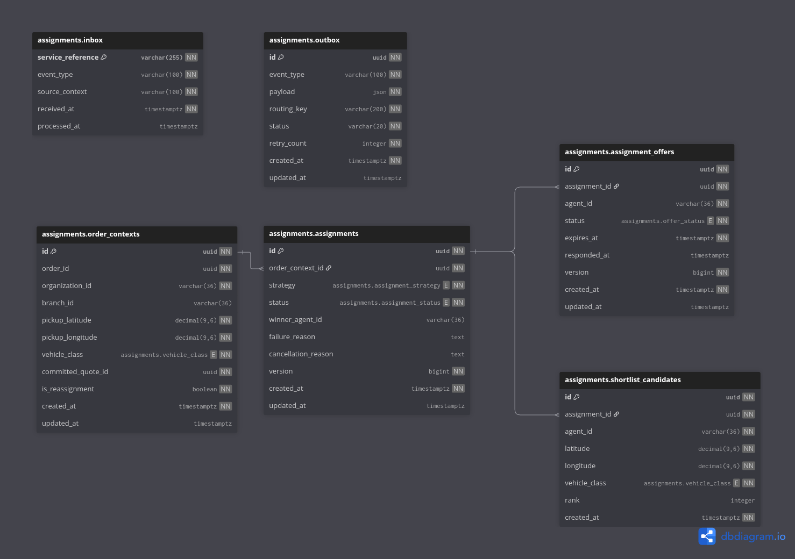

Here is a **clean, concise, functional README** aligned closely with your routing service structure:

---

# eBikes Africa — Assignment Service

> Orchestrates agent assignment lifecycle from shortlist resolution to final assignment outcome.

---

## Overview

The Assignment service owns assignment execution after an order enters `PENDING_ASSIGNMENT`.
It consumes shortlisted agents, applies assignment strategies, manages offers, and emits assignment outcomes.

**Owns:**

* Assignment orchestration and lifecycle
* Offer management (create, accept, decline, expire, cancel)
* Strategy execution (`RANKED`, `BROADCAST`, `PREASSIGNED`)
* Inbox/Outbox event processing
* Order context persistence

**Does not own:**

* Agent discovery — Workforce
* Pricing and routing — Routing
* Order lifecycle transitions — Orders

---

## Platform Context

| Relationship | Service  | How                           |
|--------------|----------|-------------------------------|
| Consumes     | Orders   | `OrderPendingAssignmentEvent` |
| Consumes     | Routing  | `AgentShortlistResolvedEvent` |
| Emits        | Orders   | Assignment outcome events     |
| Emits        | Audit    | Audit events via outbox       |
| Auth via     | Keycloak | JWT / OIDC                    |

---

## Tech Stack

| Concern   | Technology                      |
|-----------|---------------------------------|
| Language  | Java 21                         |
| Framework | Spring Boot 3.x                 |
| Database  | PostgreSQL (Liquibase)          |
| Messaging | RabbitMQ (Inbox/Outbox pattern) |
| Cache     | Redis                           |
| Auth      | Keycloak (JWT / OIDC)           |

---

## Prerequisites

| Tool           | Version |
|----------------|---------|
| Java           | 21+     |
| Maven          | 3.9+    |

---

## First-Time Setup

See [SECRETS](./documentation/SECRETS.md)

```bash
cp .env.example .env
docker compose up -d
./mvnw spring-boot:run -Dspring-boot.run.profiles=local
```

---

## Running Tests

```bash
./mvnw verify
./mvnw test
```

Coverage: `target/site/jacoco/index.html`

---

## Database Schema



---

## Environments & Deployment

| Environment  | Trigger            | Image tag      |
|--------------|--------------------|----------------|
| `dev`        | Push to `dev`      | `dev`, `sha-*` |
| `staging`    | Push to `staging`  | `staging`      |
| `production` | Release Please tag | `vX.Y.Z`       |

CI/CD defined in `.github/workflows/`.
